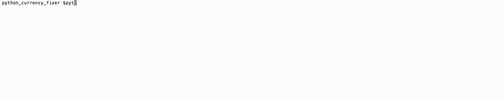

# python_currency_fixer
Get your currency with this python script via [Fixer](https://fixer.io)<br><br>

**Requirements:** 
* **Python 3 environment with additional modules specified in [requirements.txt](requirements.txt)**
* **Fixer API Key (accessible after [registering a subscription plan at Fixer](https://fixer.io/product))**
 

## configurations
To update existing [currency_configurations](currency_configurations.py), run [update_currency_configurations](update_currency_configurations.py) while providing your Fixer API Key as parameter. You can update the maximum number of failed attempts on requesting currency data at [retry_configurations](retry_configurations.py). 

## get_currency
By default, uses [Fixer](https://fixer.io) free and legacy accounts to display exchange rate for all currencies with EUR as base currency in the amounts of one unit for today's date. Results are sorted by date in ascending order and then by currency symbol in ascending order. 

### Purpose
Users can query the exchange rate according to their needs and: 
* See the results in a command line interface of their choice 
* [Store the results in a flat file for later use](README.md#do-you-have-the-option-for-saving-my-csv-output-into-a-flatfile)

### Required Parameters
* **apiaccesskey**: Register for an API Key at [Fixer](https://fixer.io)

### Optional Parameters
* **datelist**: Date list where each date is in YYYY-MM-DD format. Used for retrieving exchange rate within the time points specified in date list. If not specified, uses today's date **[1]**.
* **currencynamelist**: Currency name list where each currency name represents a wildcard for matching any currencies from currency dictionary found within [currency configurations](currency_configurations.py)
* **symbollist**: Currency symbol list where each currency symbol must match to any currency symbols from currency dictionary found within [currency configurations](currency_configurations.py) (case insensitive)
* **basecurrency**: Currency base for calculating the exchange rate represented as currency symbol.
* **amount**: The amount to be converted from the base currency. Amount can be between the values of one hundredth to one million and is rounded to the nearest hundredth.
* **daysinterval**: Determines the number of consecutive days from parameter datelist for retrieving exchange rate within those dates. In order for daysinterval to take effect, only one date should be specified in datelist.

**[1]** Today's date is based on your computer's time zone. Fixer may not have available data for today's date if your timezone is more ahead than others. In those instances, it is recommended to specify a date explicitly by using the parameter datelist.

### Flag Parameters
* **debug**: Prints helpful information for debugging.
* **visual**: Makes output human readable instead of csv format.
* **legacy_user**: For a limited time, [Fixer currently offers additional features for free to legacy users](https://fixer.io/signup/legacy), such as the ability to use any currency as your base and SSL support. Please turn this flag on if you are a legacy user. If this flag is turned off, our script will do some workarounds to still be able to use any currency as your base.
* **no_header**: Output does not display header which can be useful when appending data to existing files.
* **sort_by_symbol**: By default, the output is sorted by date in ascending order and then by currency symbol in ascending order. This flag overrides the default sorting with currency symbol in ascending order and then by date in ascending order.

### Output 
**1. currency_name** (Currency Name)<br>
**2. symbol** (Symbol)<br>
**3. date** (Date)<br>
**4. amount** (Amount)<br>
**5. rate** (Rate)<br>
**6. reciprocal_rate** (Reciprocal Rate)<br>

**[1]** _parenthesis = column name when visual flag is turned on_

### Q&A

#### How do I filter output to only the currencies I need?

> You can either use optional parameter **currencynamelist** for entering a list that is similar to the currency name list within our [currency configurations](currency_configurations.py) or use the optional parameter **symbollist** for entering a list of symbols that match with the symbols list found in our [currency configurations](currency_configurations.py) (case insensitive).  

#### How do I sort the output?

> By default, the output is sorted by date in ascending order and then by currency symbol in ascending order. Use the optional flag parameter **sort_by_symbol** to sort instead by currency symbol in ascending order and then by date in ascending order.

#### I am a free user in Fixer. Can I use any base currencies with this script?

> Yes. Currently, Fixer only allows EUR as their base currency for free users. Our script does some workarounds to closely resemble of fetching results with a different base currency. If you used the old Fixer without API key, for a limited time, you can use any base currency by registering a [legacy account](https://fixer.io/signup/legacy). Just do not forget to add the flag parameter **legacy_user** when using our script.

#### I am a free user in Fixer. I do not have access to the Time-Series Endpoint. Can I use your script to do that?

> Yes. However, unlike running a Time-Series Endpoint will cost you one API call, our script will cost you one API call for each date you input in our optional parameter **datelist**. For instance, if you want to find the rates between 2018-03-01 and 2018-03-10, you will need to type `--datelist 2018-03-01 2018-03-02 2018-03-03 2018-03-04 2018-03-05 2018-03-06 2018-03-07 2018-03-08 2018-03-09 2018-03-10` which will cost you ten API calls. 

#### That is a lot to type. Is there a shortcut version for doing the same thing with your script?

> Yes. From the previous query, you can do the same thing by using the optional parameter **daysinterval** by typing `--datelist 2018-03-01 --daysinterval 9`. Make sure **daysinterval** is a positive number and no more than one date is entered in parameter **datelist**. Otherwise, it will not work.

#### I am getting the following error: API request volume has been reached. How is that possible?

> [Each plan](https://fixer.io/product) has a quota of how many API calls you can do per month. At the moment of this writing, free accounts are allowed to make up to a thousand API calls per month. Some of the reasons where your API limit has reached could be due to calling our script too often or requesting a long date range within our script. Did you know that requesting rates between 2018-03-01 to 2018-03-10 costs ten API calls even when you run this script only once? One way to save the number of API calls you do per month is by [storing the data you frequently use in a flat file](README.md#do-you-have-the-option-for-saving-my-csv-output-into-a-flatfile) which can be later used as a source by storing it into a data lake/database/spreadsheet.

#### I am a free user in Fixer. I do not have access to the Conversion Endpoint. Can I use your script to do that?

> Yes. You can get your desired conversion by using the optional parameter **amount** which will reflect on the rate and reciprocal rate columns. **amount** can take values between one hundredth to one million. 

#### What do you output? What choices do I have for the output?

> Check the [list of columns we output](README.md#output) for more info.<br><br>We currently have two choices for output: CSV and human-readable. To see your output in a human-readable format, add the flag parameter **visual**. 

#### Your currency configurations are out of date? Do I have to update your currency configurations manually?

> You can update your [currency configurations](currency_configurations.py) automatically by running the python script **update_currency_configurations** by typing `python3 update_currency_configurations.py "<access-key-id>"`. Each time you update will cost you one API call.

#### Do you have the option for saving my CSV output into a flatfile?

> If you are in a linux environment, you have the ability to write the CSV output into a new flatfile by typing `python3 get_currency.py "<access-key-id>" > myflatfile.csv` or append to an existing flatfile by typing `python3 get_currency.py "<access-key-id>" --no_header >> myflatfile.csv` 

#### Do you have the option for getting only the columns I need?

> If you are in a linux environment and already saved your CSV output into a flatfile (see previous question), then by checking the [list of columns we output](README.md#output), you can create a new flatfile by creating only the columns you need. For instance, if we want from `myflatfile.csv` only the `symbol` and `rate` in a new flatfile called `derivedflatfile.csv`, then we type `cut -d ',' -f 2,5 myflatfile.csv > derivedflatfile.csv` 

### Examples

`python3 get_currency.py <access-key-id> --visual --datelist 2018-03-01 2017-03-01 --currencynamelist mex aus eur`
```
Currency Name                           Symbol            Date      Amount                            Rate                 Reciprocal Rate
============================================================================================================================================
Australian Dollar                       AUD         2017-03-01        1.00                1.37636900000000                0.72654934832156
Euro                                    EUR         2017-03-01        1.00                1.00000000000000                1.00000000000000
Mexican Peso                            MXN         2017-03-01        1.00               20.91669800000000                0.04780869332244
Australian Dollar                       AUD         2018-03-01        1.00                1.58082500000000                0.63258108898834
Euro                                    EUR         2018-03-01        1.00                1.00000000000000                1.00000000000000
Mexican Peso                            MXN         2018-03-01        1.00               23.12974600000000                0.04323437014829
```

`python3 get_currency.py <access-key-id> --visual --datelist 2018-03-01 --daysinterval 3 --symbollist MXN AUD EUR --basecurrency BTC --amount 12.5`
```
Currency Name                           Symbol            Date      Amount                            Rate                 Reciprocal Rate
============================================================================================================================================
Australian Dollar                       AUD         2018-03-01       12.50           174870.02212389380391                0.00089352078820
Euro                                    EUR         2018-03-01       12.50           110619.46902654867695                0.00141250000000
Mexican Peso                            MXN         2018-03-01       12.50          2558600.22123893824356                0.00006106854783
Australian Dollar                       AUD         2018-03-02       12.50           177055.91517857144028                0.00088248957874
Euro                                    EUR         2018-03-02       12.50           111607.14285714285882                0.00140000000000
Mexican Peso                            MXN         2018-03-02       12.50          2590106.36160714303336                0.00006032570798
Australian Dollar                       AUD         2018-03-03       12.50           183613.54166666668292                0.00085097209379
Euro                                    EUR         2018-03-03       12.50           115740.74074074074507                0.00135000000000
Mexican Peso                            MXN         2018-03-03       12.50          2679690.27777777783865                0.00005830897746
Australian Dollar                       AUD         2018-03-04       12.50           185560.04672897197454                0.00084204548745
Euro                                    EUR         2018-03-04       12.50           116822.42990654205743                0.00133750000000
Mexican Peso                            MXN         2018-03-04       12.50          2710908.17757009337928                0.00005763751104
```

### Versions
**Current Version:** [0.07](README.md#version-007)
#### Version 0.01
* Initial Draft
#### Version 0.02
* Changed default base currency from USD to EUR
* Added script **update_currency_configurations** that allow you to update automatically [currency configurations](currency_configurations.py) with the use of Fixer Supported Symbols Endpoint.
* Added documentation for all existing configurations.
#### Version 0.03
* The formatting of numerical figures is in decimal format. If output in API is found in scientific notation, it is converted to decimal format. To keep accuracy of calculations, we keep them in decimal format. After calculations, we round them up with a precision of 12 digits and show the output of all numerical figures with 12 digits.
* Fixed output issues on the use cases when it was not encoded to `utf-8` properly. 
* Renamed the names shown in header. Check [output](README.md#output) for more info.
* Added new column: **reciprocal_rate** which represents `1/rate`
* Added flag parameter **no_header** that allows to show output without the headers. Useful for appending data to existing files that contains the header already.
* Added flag parameter **legacy_user**. If user is not a legacy_user, API by default does not provide user to use any base currency except `EUR`. We did some workarounds in our code where free users can use any base currency in our script and get the same results as a legacy user. For instance, one Bitcoin is 308977626 Iranian Rial when running our script as a legacy user while one Bitcoin is 308669168 Iranian Rial when running our script as a free user with our workarounds. The difference between the two results is close to one Euro cent. If you are a legacy user, we recommend to add the flag `legacy_user` in your script to get the most accurate results.
* Added Q&A Section in our documentation for all existing and new features.
#### Version 0.04
* Numerical figures extended from 12 digits to 14 digits and increased decimal precision.
* Added a new column and optional parameter **amount** which is used to multiply the `rate`. The optional parameter amount must be between the values of one hundredth and one million and is rounded to the nearest one hundredth.
* Added optional parameter **symbollist** that allows filtering output by only the list of symbols in the symbolllist that match with the symbols within the [currency configurations](currency_configurations.py) (case insensitive).
* Added optional parameter **daysinterval** that represents the number of consecutive days from the parameter datelist for the use of retrieving exchange rate within those dates. Parameter daysinterval must be a positive number and can have only one date in parameter datelist. 
* Updated main documentation and Q&A section on existing and new features.
#### Version 0.05
* Script converted from **Python 2** to **Python 3**. Unfortunately, we are dropping support for Python 2. The latest supported working version of python_currensy_fixer for Python 2 is [Version 0.04](https://github.com/asokratis/python_currency_fixer/releases/tag/v0.04). 
* All output is sorted by date in ascending order and then by currency symbol in ascending order.
* To keep track of all new changes properly, [currency configurations](currency_configurations.py), as well script **update_currency_configurations** is now sorted by currency symbol in ascending order.
* Optional parameter **daysinterval** now supports negative numbers.
* Updated main documentation on the new features and added required modules for python_currency_fixer in [requirements.txt](requirements.txt)
#### Version 0.06
* Streamline output: Before, printing output was called for every API call. Now, printing output is only done once after all API calls are done.
* Added optional flag parameter **sort_by_symbol** that sorts results instead by currency symbol in ascending order and then by date in ascending order.
* Updated main documentation and Q&A section on existing and new features.
#### Version 0.07
* Fixed wrong calculation of reciprocal rate.
