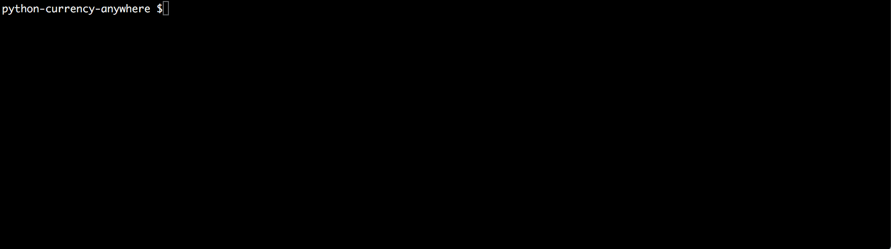

# python-currency-anywhere

A microservice to get currency in different formats from any service provider<br><br>


**Requirements:** 
* **Python 3 environment with additional modules specified in [requirements.txt](requirements.txt)**
* **An API Key from one to many currency service providers (i.e. For starters, register a subscription plan at [fixer](https://fixer.io/product), [openexchangerates](https://openexchangerates.org/signup), [currencylayer](https://currencylayer.com/product))**
 

## Why use python-currency-anywhere?
 
* **User-Friendly**: With thorough documentation and debugging provided, you will never be lost.
* **Cached**: Relying all your requests on a currency service provider will make you reach your monthly API limits in no time. With our script storing all your requests on your local database, you will never have to worry about limits anymore.
* **Features**: With just a free currency service provider account, we are able to simulate within our script all premium features paid currency services provides.
* **Outputs**: Get your output in a human-readable way through your terminal or save your output to a new flat file.

## Installation
* Create an account from a currency service provider that is compatible ([fixer](https://fixer.io/product), [openexchangerates](https://openexchangerates.org/signup), [currencylayer](https://currencylayer.com/product)).<br>
* Once logged in at currency service provider, get your API key from your dashboard.
* Paste the key on [settings](settings.ini) within `value_apikey` without enclosing it with quotes matching the service provider registered and run the script by doing the following: **[1]**   
```shell
git clone https://github.com/asokratis/python-currency-anywhere
cd python-currency-anywhere
sudo pip3 install -r requirements.txt 
python3 update_currency_configurations.py <servicenameprovider>
python3 get_currency.py <servicenameprovider>
```
**[1]** _Replace `<servicenameprovider>` with the service provider registered._<br>
**[1]** _If you have encoding errors when running the script, you may additionally need to run `export PYTHONIOENCODING=utf_8`_

## configurations
Due to legal constraints, [currency_configurations](configurations/currency_configurations.py) does not reflect all of currencies  because they are retrieved by [scraping the currencies from Wikipedia](https://en.wikipedia.org/wiki/List_of_circulating_currencies). To update existing [currency_configurations](configurations/currency_configurations.py), run [update_currency_configurations](update_currency_configurations.py) while providing the name of your service provider as the parameter.<br><br>You can also update the maximum number of failed attempts by requesting currency data at [retry_configurations](configurations/retry_configurations.py). 

## get_currency
By default, uses the free and basic accounts of the compatible currency service providers to display exchange rate for all currencies with EUR as the base currency in the amounts of one unit for today's date. Results are sorted by date in ascending order and then by currency symbol in ascending order. Results are also cached by date (and base currency if using legacy/basic accounts) so next time they are requested, you are not charged an API call.

### General Purpose
Users can query the exchange rate according to their needs and: 
* See the results in a command line interface of their choice 
* [Store the results in a flat file for later use](README.md#do-you-have-the-option-for-saving-my-csv-output-into-a-flatfile)

### Required Parameters
* **serviceprovider**: The name of the currency service provider. See [settings](settings.ini) to check currently compatible service providers.

### Optional Parameters
* **datelist**: Date list where each date is in YYYY-MM-DD format. Used for retrieving exchange rate within the time points specified in date list. If not specified, uses today's date **[1]**.
* **currencynamelist**: Currency name list where each currency name represents a wildcard for matching any currencies from currency dictionary found within [currency configurations](configurations/currency_configurations.py)
* **symbollist**: Currency symbol list where each currency symbol must match to any currency symbols from currency dictionary found within [currency configurations](configurations/currency_configurations.py) (case insensitive)
* **basecurrency**: Currency base for calculating the exchange rate represented as currency symbol.
* **amount**: The amount to be converted from the base currency. Amount can be between the values of one hundredth to one million and is rounded to the nearest hundredth.
* **daysinterval**: Determines the number of consecutive days from parameter datelist for retrieving exchange rate within those dates. In order for daysinterval to take effect, only one date should be specified in datelist.

**[1]** Today's date is based on your computer's time zone. Your service provider may not have available data for today's date if your timezone is more ahead than others. In those instances, it is recommended to specify a date explicitly by using the parameter datelist.

### Flag Parameters
* **debug**: Prints activity for debugging, such as URL used for calling API and query used for fetching data from the database.
* **visual**: Makes output human readable instead of csv format.
* **paid_membership**: You can turn this flag on if you are a paying subscriber to a currency service provider **[1]**. If this flag is turned off, our script will do some workarounds to still be able to use any currency as your base. 
* **no_header**: Output does not display header which can be useful when appending data to existing files.
* **sort_by_symbol**: By default, the output is sorted by date in ascending order and then by currency symbol in ascending order. This flag overrides the default sorting with currency symbol in ascending order and then by date in ascending order.
* **output_fluctuation**: Sorts output in the same format as flag parameter sort_by_symbol and displays fluctuation data by adding the following two columns within the output: perc_diff and difference.

**[1]** If its still available, [fixer offers paid membership features for free to legacy users](https://fixer.io/signup/legacy), such as the ability to use any currency as your base and SSL support. 

### Output 
**1. currency_name** (Currency Name)<br>
**2. symbol** (Symbol)<br>
**3. date** (Date)<br>
**4. amount** (Amount)<br>
**5. rate** (Rate)<br>
**6. reciprocal_rate** (Reciprocal Rate)<br>
**7. perc_diff** (Perc. Diff.) **[2]**<br>
**8. difference** (Difference) **[2]**<br>

**[1]** _parenthesis = column name when visual flag is turned on_<br>
**[2]** _these columns only show up when flag parameter output_fluctuation is enabled_

### Q&A

#### What do you output? What choices do I have for the output?

> Check the [list of columns we output](README.md#output) for more info.<br><br>We currently have two choices for output: CSV and human-readable. To see your output in a human-readable format, add the flag parameter **visual**. 

#### How do I filter output to only the currencies I need?

> You can either use optional parameter **currencynamelist** for entering a list that is similar to the currency name list within our [currency configurations](configurations/currency_configurations.py) or use the optional parameter **symbollist** for entering a list of symbols that match with the symbols list found in our [currency configurations](configurations/currency_configurations.py) (case insensitive).  

#### How do I sort the output?

> By default, the output is sorted by date in ascending order and then by currency symbol in ascending order. Use the flag parameter **sort_by_symbol** to sort instead by currency symbol in ascending order and then by date in ascending order.

#### I am a free user in my currency service provider. Can I use any base currencies with this script?

> Yes. Currently, most currency service providers provide only EUR or USD as their base currency for free users. Our script does some workarounds to closely resemble of fetching results with a different base currency. If you used the old Fixer without API key, for a limited time, you can use any base currency by registering a [legacy account](https://fixer.io/signup/legacy). Just do not forget to add the flag parameter **paid_membership** when using our script.

#### I am a free user in my currency service provider. I do not have access to the Time-Series Endpoint. Can I use your script to do that?

> Yes. However, unlike running a Time-Series Endpoint will cost you one API call, our script will cost you one API call for each date you input in our optional parameter **datelist**. For instance, if you want to find the rates between 2018-03-01 and 2018-03-10, you will need to type `--datelist 2018-03-01 2018-03-02 2018-03-03 2018-03-04 2018-03-05 2018-03-06 2018-03-07 2018-03-08 2018-03-09 2018-03-10` which will cost you ten API calls. 

#### That is a lot to type. Is there a shortcut version for doing the same thing with your script?

> Yes. From the previous query, you can do the same thing by using the optional parameter **daysinterval** by typing `--datelist 2018-03-01 --daysinterval 9`. Make sure only one date is entered in parameter **datelist**. Otherwise, it will not work.

#### I am getting the following error: API request volume has been reached. How is that possible?

> Each plan has a quota of how many API calls you can do per month. At the moment of this writing, most free accounts are allowed to make up to a thousand API calls per month. Some of the reasons where your API limit has reached could be due to calling our script too often or requesting a long date range within our script. Did you know that requesting rates between 2018-03-01 to 2018-03-10 costs ten API calls even when you run this script only once? **We do our best on archiving every API call you do into an SQLite database so you do not get charged again.** We recommend you though to turn off flag parameter **paid_membership** at the cost of accuracy so all your data is cached by default only once per date by the default base currency of the service provider. Otherwise, there will be one API call for every base currency requested for that date.

#### I am a free user in my currency service provider. I do not have access to the Conversion Endpoint. Can I use your script to do that?

> Yes. You can get your desired conversion by using the optional parameter **amount** which will reflect on the rate and reciprocal rate columns. **amount** can take values between one hundredth to one million. 

#### I am a free user in my currency service provider. I do not have access to the Fluctuation Data Endpoint. Can I use your script to do that?

> Yes. You can get fluctuation data by using the optional flag parameter **output_fluctuation**. Other than the output will be sorted in the same format optional flag parameter **sort_by_symbol** does, you will get two new columns in your output: **perc_diff.** and **difference**. 

#### Your currency configurations are out of date? Do I have to update your currency configurations manually?

> You can update your [currency configurations](configurations/currency_configurations.py) automatically by running the python script **update_currency_configurations** by typing `python3 update_currency_configurations.py "<servicenameprovider>"`. For most currency service providers, each time you update will cost you one API call.

#### Do you have the option for saving my CSV output into a flatfile?

> If you are in a linux environment, you have the ability to write the CSV output into a new flatfile by typing `python3 get_currency.py "<servicenameprovider>" > myflatfile.csv` or append to an existing flatfile by typing `python3 get_currency.py "<servicenameprovider>" --no_header >> myflatfile.csv` 

#### Do you have the option for getting only the columns I need?

> If you are in a linux environment and already saved your CSV output into a flatfile (see previous question), then by checking the [list of columns we output](README.md#output), you can create a new flatfile by creating only the columns you need. For instance, if we want from `myflatfile.csv` only the `symbol` and `rate` in a new flatfile called `derivedflatfile.csv`, then we type `cut -d ',' -f 2,5 myflatfile.csv > derivedflatfile.csv` 

#### Great! How do I store my flat file into a database?

> By default, every time you do an API call, it gets archived into an SQLite database in the data folder with filename **currency_servicenameprovider_eur.sqlite** (**currency_servicenameprovider_<base_currency>.sqlite** if flag parameter **paid_membership** is enabled). All the data in the database is stored in the table `currency` with columns `symbol`, `date`, `rate`. On the long run, this will give you the ability to do more calls via our script without being charged any API calls from your subscription.<br><br>If you are looking for something more specific to store in your database from a flat file, try [SQLite in Python](http://sebastianraschka.com/Articles/2014_sqlite_in_python_tutorial.html). Assuming you have a flat file called `feb2018.csv`, you can do the following:
```python
import csv, sqlite3

sqlite_file = 'my_db.sqlite'
con = sqlite3.connect(sqlite_file)
cur = con.cursor()
cur.execute("CREATE TABLE currency_base_eur (symbol, date, rate);”) 

with open(‘feb2018.csv','r') as fin:
    dr = csv.DictReader(fin) 
    to_db = [(i[‘symbol’], i[‘date’], i[‘rate’]) for i in dr]

cur.executemany("INSERT INTO currency_base_eur (symbol, date, rate) VALUES (?, ?, ?);”, to_db)
con.commit()
cur.execute("SELECT * FROM currency_base_eur WHERE symbol = 'USD';")
all_rows = cur.fetchall()
print(all_rows)
con.close()
```

### Examples

`python3 get_currency.py <servicenameprovider> --visual --datelist 2018-03-01 2017-03-01 --currencynamelist mex aus eur`
```
Currency Name                           Symbol            Date      Amount                            Rate                 Reciprocal Rate
============================================================================================================================================
Australian Dollar                       AUD         2017-03-01        1.00                1.37636900000000                0.72654934832156
Euro                                    EUR         2017-03-01        1.00                1.00000000000000                1.00000000000000
Mexican Peso                            MXN         2017-03-01        1.00               20.91669800000000                0.04780869332244
Australian Dollar                       AUD         2018-03-01        1.00                1.58082500000000                0.63258108898834
Euro                                    EUR         2018-03-01        1.00                1.00000000000000                1.00000000000000
Mexican Peso                            MXN         2018-03-01        1.00               23.12974600000000                0.04323437014829
```

`python3 get_currency.py <servicenameprovider> --visual --datelist 2018-03-01 --daysinterval 3 --symbollist MXN AUD EUR --basecurrency BTC --amount 12.5`
```
Currency Name                           Symbol            Date      Amount                            Rate                 Reciprocal Rate
============================================================================================================================================
Australian Dollar                       AUD         2018-03-01       12.50           174870.02212389380391                0.00089352078820
Euro                                    EUR         2018-03-01       12.50           110619.46902654867695                0.00141250000000
Mexican Peso                            MXN         2018-03-01       12.50          2558600.22123893824356                0.00006106854783
Australian Dollar                       AUD         2018-03-02       12.50           177055.91517857144028                0.00088248957874
Euro                                    EUR         2018-03-02       12.50           111607.14285714285882                0.00140000000000
Mexican Peso                            MXN         2018-03-02       12.50          2590106.36160714303336                0.00006032570798
Australian Dollar                       AUD         2018-03-03       12.50           183613.54166666668292                0.00085097209379
Euro                                    EUR         2018-03-03       12.50           115740.74074074074507                0.00135000000000
Mexican Peso                            MXN         2018-03-03       12.50          2679690.27777777783865                0.00005830897746
Australian Dollar                       AUD         2018-03-04       12.50           185560.04672897197454                0.00084204548745
Euro                                    EUR         2018-03-04       12.50           116822.42990654205743                0.00133750000000
Mexican Peso                            MXN         2018-03-04       12.50          2710908.17757009337928                0.00005763751104
```

### Contribution

If you want to give out a hand, create an issue or pull request and categorize it with the following labels:
* **Maintainance:** Reporting bugs. Fixing bugs. Refactoring code. Unit testing.
* **Flexibility:** Adding more currency service providers, such as [European Central Bank Feed](http://www.ecb.europa.eu/stats/eurofxref/eurofxref-daily.xml), as well cryptocurrency API services, such as [coinapi](https://www.coinapi.io/pricing) and [cryptocompare](https://min-api.cryptocompare.com/).
* **Convenience:** The ability to use multiple sources for a single output (i.e. Give me output X that uses service provider Y to get currency A, B, C, and service provider Z to get currency D, E, F)

### Versions
**Current Version:** [0.11](README.md#version-011)
#### Version 0.01
* Initial Draft
#### Version 0.02
* Changed default base currency from USD to EUR
* Added script **update_currency_configurations** that allow you to update automatically [currency configurations](configurations/currency_configurations.py) with the use of Fixer Supported Symbols Endpoint.
* Added documentation for all existing configurations.
#### Version 0.03
* The formatting of numerical figures is in decimal format. If output in API is found in scientific notation, it is converted to decimal format. To keep accuracy of calculations, we keep them in decimal format. After calculations, we round them up with a precision of 12 digits and show the output of all numerical figures with 12 digits.
* Fixed output issues on the use cases when it was not encoded to `utf-8` properly. 
* Renamed the names shown in header. Check [output](README.md#output) for more info.
* Added new column: **reciprocal_rate** which represents `1/rate`
* Added flag parameter **no_header** that allows to show output without the headers. Useful for appending data to existing files that contains the header already.
* Added flag parameter **legacy_user**. If user is not a legacy_user, API by default does not provide user to use any base currency except `EUR`. We did some workarounds in our code where free users can use any base currency in our script and get the same results as a legacy user. For instance, one Bitcoin is 308977626 Iranian Rial when running our script as a legacy user while one Bitcoin is 308669168 Iranian Rial when running our script as a free user with our workarounds. The difference between the two results is close to one Euro cent. If you are a legacy user, we recommend to add the flag `legacy_user` in your script to get the most accurate results.
* Added Q&A Section in our documentation for all existing and new features.
#### Version 0.04
* Numerical figures extended from 12 digits to 14 digits and increased decimal precision.
* Added a new column and optional parameter **amount** which is used to multiply the `rate`. The optional parameter amount must be between the values of one hundredth and one million and is rounded to the nearest one hundredth.
* Added optional parameter **symbollist** that allows filtering output by only the list of symbols in the symbolllist that match with the symbols within the [currency configurations](configurations/currency_configurations.py) (case insensitive).
* Added optional parameter **daysinterval** that represents the number of consecutive days from the parameter datelist for the use of retrieving exchange rate within those dates. Parameter daysinterval must be a positive number and can have only one date in parameter datelist. 
* Updated main documentation and Q&A section on existing and new features.
#### Version 0.05
* Script converted from **Python 2** to **Python 3**. Unfortunately, we are dropping support for Python 2. The latest supported working version of python_currensy_fixer for Python 2 is [Version 0.04](https://github.com/asokratis/python_currency_fixer/releases/tag/v0.04). 
* All output is sorted by date in ascending order and then by currency symbol in ascending order.
* To keep track of all new changes properly, [currency configurations](configurations/currency_configurations.py), as well script **update_currency_configurations** is now sorted by currency symbol in ascending order.
* Optional parameter **daysinterval** now supports negative numbers.
* Updated main documentation on the new features and added required modules for python_currency_fixer in [requirements.txt](requirements.txt)
#### Version 0.06
* Streamline output: Before, printing output was called for every API call. Now, printing output is only done once after all API calls are done.
* Added flag parameter **sort_by_symbol** that sorts results instead by currency symbol in ascending order and then by date in ascending order.
* Updated main documentation and Q&A section on existing and new features.
#### Version 0.07
* Fixed wrong calculation of reciprocal rate.
#### Version 0.08
* Added flag parameter **output_fluctuation** that sorts output in the same format as flag parameter sort_by_symbol and displays fluctuation data by adding the following two columns within the output: **perc_diff** and **difference**.
* Added new section within documentation: **Installation**.
* Fixed encoding issues when running **update_currency_configurations**.
* Updated main documentation and Q&A section on existing and new features.
#### Version 0.09
* Added the ability to **cache data into an SQLite database**. This allows user to not get charged the next time it calls API for the same date (or same date and base currency if having flag parameter legacy_user turned on). The database is stored in data folder with filename **currency_eur.sqlite** (or **currency_<base_currency>.sqlite** if flag parameter legacy_user is enabled). All the data in the database is stored in the table `currency` with columns `symbol`, `date`, `rate`. 
* To remove clutter, moved the location of configurations (currency_configurations.py, retry_configurations.py) in the **configurations folder**.
* Flag parameter **debug** will display running queries on database and URL API calls for data not available at database. 
* Updated main documentation and Q&A section on existing and new features.
#### Version 0.10
* Legal stuff: Added script **wikipedia_currency_configurations.py[1]** for downloading the currencies from Wikipedia and to load them into [currency configurations](configurations/currency_configurations.py). Fixer (and most likely any other subscription API) does not allow you to **share** the API data that you retrieve from them with your API key. **It is only for your personal use**. 
* The default [currency configurations](configurations/currency_configurations.py) provided is replaced by the data provided by Wikipedia instead of Fixer. Please follow all steps in [Installation](README.md#installation) so [currency configurations](configurations/currency_configurations.py) reflect all currencies in Fixer ([requires registration of a Fixer API key](https://fixer.io/product))
* Updated main documentation and Q&A section on existing and new features.
#### Version 0.11
* python-currency-anywhere: Our microservice is now agnostic by the currency service provider that you want to use. Currently, made it compatible with currency service providers fixer, openexchangerates, and currencylayer.

**[1]** Uses BeautifulSoup4 (for scraping) and regex (for regular expressions)<br>

All images are extracted/derived from [openclipart](https://openclipart.org/) <br>_The one stop public domain clipart images for unlimited commercial use._